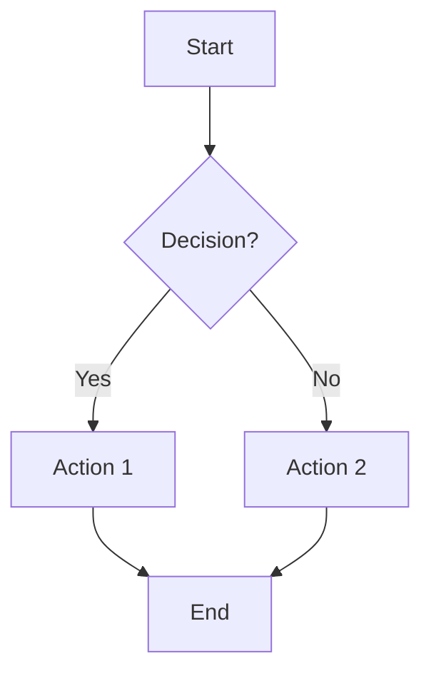
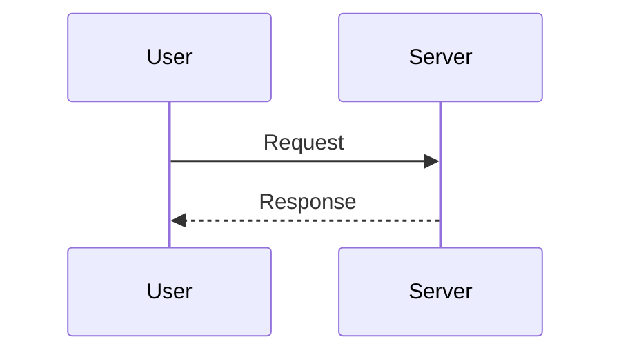
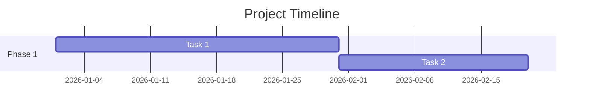
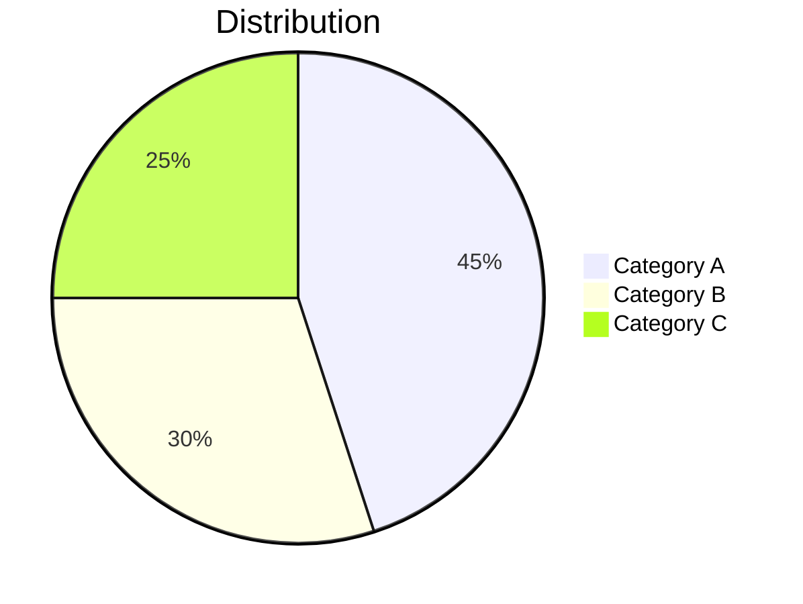

# Mermaid Generator

Generate flowcharts, diagrams, and visualizations from text descriptions using Mermaid.js syntax,
rendered to SVG/PNG via the mermaid.ink API.

## When to Use

- Flowcharts (processes, decision trees, workflows)
- Sequence diagrams (API flows, user interactions)
- Class/entity diagrams (data models, relationships)
- State diagrams (lifecycles, status flows)
- Gantt charts (timelines, project plans)
- Pie charts (data distribution)

## Input

- **topic**: What the diagram should show
- **type**: flowchart | sequence | class | state | gantt | pie
- **direction**: TD (top-down) | LR (left-right) — default TD for flowcharts, LR for sequences

## Process

### 1. Generate Mermaid Markup

Write valid Mermaid syntax. Common patterns:

**Flowchart:**


**Sequence Diagram:**


**Gantt (Timeline):**


**Pie Chart:**


### 2. Render via mermaid.ink

The mermaid.ink API renders Mermaid diagrams to SVG via a simple GET request.

```bash
# Encode the Mermaid markup to base64
MERMAID_CODE="flowchart TD\n    A[Start] --> B[End]"
ENCODED=$(echo -e "$MERMAID_CODE" | base64 -w 0)

# Fetch the rendered SVG
curl -s "https://mermaid.ink/svg/${ENCODED}" -o output.svg
```

Alternative for PNG:
```bash
curl -s "https://mermaid.ink/img/${ENCODED}" -o output.png
```

### 3. Validate

- Check that the output file is valid SVG/PNG (not an error page)
- If mermaid.ink returns an error → check Mermaid syntax for issues
- If mermaid.ink is down → output raw Mermaid code and inform user

### 4. Save

Save to `_assets/media-factory/{project}/svg/{filename}.svg`
Write metadata sidecar.

## Fallback

1. If mermaid.ink is unreachable → try again once after 5 seconds
2. If still fails → save the raw Mermaid markdown to a `.mmd` file
3. Inform user: "mermaid.ink nicht erreichbar. Mermaid-Code gespeichert: {path}. Kann lokal mit `npx mmdc -i file.mmd -o file.svg` gerendert werden."
