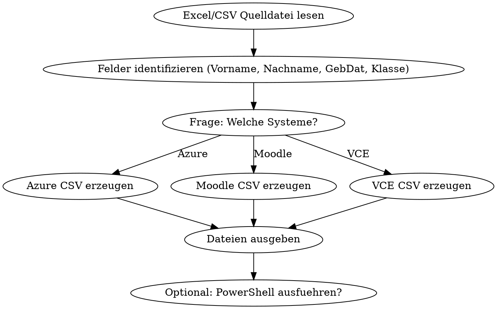

# User Import Prepare

## Overview

Generates import-ready CSV files for all three school systems (Azure/MS365, Moodle, VCE) from a single source list. Input: Excel/CSV with Vorname, Nachname, Geburtsdatum, Klasse. Output: Up to three CSV files, one per target system.

## When to Use

- New class needs to be set up across systems
- New students ("Nachzügler") need accounts
- Beginning of school year / semester user creation
- Teacher asks to "prepare import files"

## Source Data (4 Required Fields)

| Feld | Beispiel | Hinweis |
|------|----------|---------|
| Vorname | Jürgen | Kann Leerzeichen enthalten ("Hans Peter") |
| Nachname | Schäfer | Kann Bindestriche enthalten ("Müller-König") |
| Geburtsdatum | 12.09.2006 | Format: DD.MM.YYYY |
| Klasse | BG2414 | Schulklassencode |

## Character Replacement (Azure + Moodle)

Applied to names for username/email generation. Case-sensitive.

```
ä → ae    Ä → Ae
ö → oe    Ö → Oe
ü → ue    Ü → Ue
ß → ss
é → e     è → e
à → a     á → a
ó → o     ć → c     Ş → S
[SPACE] → - (Leerzeichen wird Bindestrich)
```

VCE uses **no replacement** - original names with umlauts are kept.

## System 1: Azure/MS365

### CSV Format

Delimiter: Comma (`,`)

```
Name,UserPrincipalName,InitialPassword,AccountEnabled,FirstName,LastName,JobTitle,Department,UsageLocation,StreetAddress,State,Country,Office,City,PostalCode
```

### Field Derivation

| Feld | Regel | Beispiel |
|------|-------|----------|
| Name | `{Vorname} {Nachname}` (Original mit Umlauten) | Jürgen Schäfer |
| UserPrincipalName | `{vorname_replaced}.{nachname_replaced}@bs32.de` (lowercase) | juergen.schaefer@bs32.de |
| InitialPassword | `BS05_2025` (fest) | BS05_2025 |
| AccountEnabled | `TRUE` (fest) | TRUE |
| FirstName | Vorname nach Replace | Juergen |
| LastName | Nachname nach Replace | Schaefer |
| JobTitle | Klasse | BG2414 |
| Department | `Schüler` (fest, bei Lehrern: `Lehrer`) | Schüler |
| UsageLocation | `DE` (fest) | DE |
| StreetAddress | `Hinrichsenstrasse` (fest) | Hinrichsenstrasse |
| State | `Hamburg` (fest) | Hamburg |
| Country | `Germany` (fest) | Germany |
| Office | `Hinrichsenstrasse` (fest) | Hinrichsenstrasse |
| City | `Hamburg` (fest) | Hamburg |
| PostalCode | `20535` (fest) | 20535 |

### Security Group

Für jede Klasse wird eine Security Group erstellt: `SG_{Klasse}` (z.B. `SG_BG2414`)

### PowerShell Execution (Optional)

Script: `azure/Create-NewBs32AzurePupil.ps1`
Benötigt: Microsoft Graph PowerShell SDK (`Connect-MgGraph`)

## System 2: Moodle

### CSV Format

Delimiter: Semicolon (`;`)

```
username;firstname;lastname;email;password;cohort1;cohort2;profile_field_schoolno;profile_field_schoolname;profile_field_schoolpersona
```

### Field Derivation

| Feld | Regel | Beispiel |
|------|-------|----------|
| username | `{nachname_partial}{vorname_partial}` lowercase, keine Umlaute, keine Leerzeichen, max ~12-15 Zeichen | schaeferju |
| firstname | Vorname (Original) | Jürgen |
| lastname | Nachname (Original) | Schäfer |
| email | `{Vorname_replaced}.{Nachname_replaced}@bs32.de` | Juergen.Schaefer@bs32.de |
| password | `BS05_2025` (fest) | BS05_2025 |
| cohort1 | `5922_bs` (fest) | 5922_bs |
| cohort2 | `5922_bs_{klasse_lower}` | 5922_bs_bg2414 |
| profile_field_schoolno | `5922` (fest) | 5922 |
| profile_field_schoolname | `bs32` (fest) | bs32 |
| profile_field_schoolpersona | `Schüler/in` (fest, bei Lehrern: `Lehrer/in`) | Schüler/in |

### Username-Regeln (Moodle)

1. Nachname + Vorname zusammensetzen (alles lowercase)
2. Umlaute/Sonderzeichen ersetzen (gleiche Regeln wie Azure)
3. Leerzeichen und Bindestriche entfernen
4. Kürzen auf sinnvolle Länge (~12-15 Zeichen)
5. Bei Duplikaten: Zahl anhängen oder mehr Zeichen verwenden

## System 3: VCE

### CSV Format

Delimiter: Semicolon (`;`)
**Keine Header-Zeile!**

```
431;Nachname;Vorname;Klasse;Geburtsdatum;Hamburg;SchülerIn
```

### Field Derivation

| Spalte | Regel | Beispiel |
|--------|-------|----------|
| 1 | `431` (fest = User-Typ Schüler) | 431 |
| 2 | Nachname (Original mit Umlauten) | Schäfer |
| 3 | Vorname (Original mit Umlauten) | Jürgen |
| 4 | Klasse | BG2414 |
| 5 | Geburtsdatum DD.MM.YYYY | 12.09.2006 |
| 6 | `Hamburg` (fest) | Hamburg |
| 7 | `SchülerIn` (fest) | SchülerIn |

### VCE Initialpasswort

Das Passwort wird aus dem Geburtsdatum ohne Punkte gebildet:
- Geburtsdatum `12.09.2006` → Passwort `12092006`

**Hinweis:** Das Passwort steht NICHT in der CSV. Es wird automatisch vom VCE-System vergeben basierend auf dem Geburtsdatum.

## Workflow



## Step-by-Step

1. **Quelldatei lesen**: User gibt Excel/CSV-Datei an. Lies sie mit dem Read-Tool.
2. **Spalten identifizieren**: Finde Vorname, Nachname, Geburtsdatum, Klasse (Spaltenüberschriften können variieren).
3. **User fragen**: Für welche Systeme sollen Dateien erzeugt werden? (Default: alle drei)
4. **Dateien erzeugen**: Schreibe die CSV-Dateien ins gleiche Verzeichnis wie die Quelldatei. Dateinamen:
   - `azure_{klasse}.csv`
   - `moodle_{klasse}.csv`
   - `vce_{klasse}.csv`
5. **Zusammenfassung**: Zeige dem User:
   - Anzahl verarbeiteter Datensätze
   - Erzeugte Dateien mit Pfaden
   - Hinweise auf mögliche Duplikat-Usernames
   - VCE-Passwort-Hinweis (Geburtsdatum ohne Punkte)
6. **Optional**: Frage ob PowerShell für Azure ausgeführt werden soll.

## Output Directory

Dateien werden im Verzeichnis der Quelldatei abgelegt, oder falls gewünscht in den systemspezifischen Unterordnern:
- `azure/`
- `moodle/`
- `vce/`

Basis-Pfad: `C:\Users\mail\OneDrive - Berufliche Schule City Süd (H9)\Dokumente\schule\Verwaltung\UserAnlegen\`

## Common Mistakes

| Fehler | Lösung |
|--------|--------|
| Umlaute in Azure-UPN | Replace-Funktion anwenden |
| VCE mit Umlaut-Ersetzung | VCE nutzt Original-Namen! |
| Moodle Username zu lang | Kürzen, auf Duplikate prüfen |
| Geburtsdatum falsches Format | Immer DD.MM.YYYY für VCE |
| Komma statt Semikolon | Azure = Komma, Moodle+VCE = Semikolon |
| Header in VCE | VCE hat KEINE Header-Zeile! |
